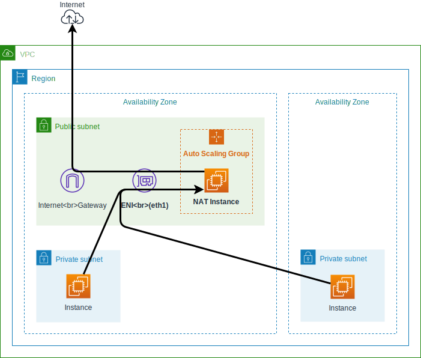

This is a Terraform module which provisions a NAT instance.

Features:

- Providing NAT for private subnet(s)
- Auto healing using an auto scaling group
- Saving cost using a spot instance (from $1/month)
- Fixed source IP address by reattaching ENI
- Supporting Systems Manager Session Manager
- Disable costly resources for compatibility with workspaces

Terraform 0.12 is required.

**Warning**: Generally you should use a NAT gateway. This module provides a
very low cost solution for testing purpose.


## Getting Started

You can use this module with
[terraform-aws-modules/vpc/aws](https://registry.terraform.io/modules/terraform-aws-modules/vpc/aws)
module as follows:

```tf
module "vpc" {
  source  = "terraform-aws-modules/vpc/aws"

  name                 = "main"
  cidr                 = "172.18.0.0/16"
  azs                  = ["us-west-2a", "us-west-2b", "us-west-2c"]
  private_subnets      = ["172.18.64.0/20", "172.18.80.0/20", "172.18.96.0/20"]
  public_subnets       = ["172.18.128.0/20", "172.18.144.0/20", "172.18.160.0/20"]
  enable_dns_hostnames = true
}

module "nat" {
  source = "int128/nat-instance/aws"

  name                        = "main"
  vpc_id                      = module.vpc.vpc_id
  public_subnet               = module.vpc.public_subnets[0]
  private_subnets_cidr_blocks = module.vpc.private_subnets_cidr_blocks
  private_route_table_ids     = module.vpc.private_route_table_ids
}
```

Now create an EC2 instance in the private subnet to verify the NAT
configuration.  Open the [AWS Systems Manager Session
Manager](https://docs.aws.amazon.com/systems-manager/latest/userguide/session-manager.html),
log in to the instance and make sure you have external access from the
instance.


## How it works

This module provisions the following resources:

- Auto Scaling Group with mixed instances policy
- Launch Template
- Elastic IP
- Elastic Network Interface
- Security Group
- ENI attachment
- VPC Route (optional)

Take a look at the diagram:



By default an instance of the latest Amazon Linux 2 is launched.
The instance will run [init.sh](data/init.sh) to enable NAT as follows:

1. Attach the ENI to `eth1`.
1. Set the kernel parameters for IP forwarding and masquerade.
1. Switch the default route to `eth1`.


## Configuration

### Set extra IAM policies

You can attach an extra policy to the IAM role of the NAT instance. For
example,

```tf
resource "aws_iam_role_policy" "nat_iam_ec2" {
  role = module.nat.iam_role_name
  policy = <<EOF
{
    "Version": "2012-10-17",
    "Statement": [
        {
            "Effect": "Allow",
            "Action": [
                "ec2:DescribeInstances"
            ],
            "Resource": "*"
        }
    ]
}
EOF
}
```

### Run a script

You can set an extra script to run in the NAT instance. The current region is
exported as `AWS_DEFAULT_REGION` and you can use awscli without a region
option.

For example, you can expose port 8080 of the NAT instance using DNAT:

```tf
module "nat" {
  extra_user_data = templatefile("${path.module}/data/nat-port-forward.sh", {
    eni_private_ip = module.nat.eni_private_ip
  })
}
```

```sh
# Look up the target instance
tag_name="TARGET_TAG"
target_private_ip="$(aws ec2 describe-instances --filters "Name=tag:Name,Values=$tag_name" | jq -r .Reservations[0].Instances[0].PrivateIpAddress)"

# Expose the port of the NAT instance.
iptables -t nat -A PREROUTING -m tcp -p tcp --dst "${eni_private_ip}" --dport 8080 -j DNAT --to-destination "$target_private_ip:8080"
```


### Allow SSH access

You can log in to the NAT instance from [AWS Systems Manager Session
Manager](https://docs.aws.amazon.com/systems-manager/latest/userguide/session-manager.html).

You can enable SSH access by setting `key_name` option and opening the security
group. For example,

```tf
module "nat" {
  key_name = "YOUR_KEY_PAIR"
}

resource "aws_security_group_rule" "nat_ssh" {
  security_group_id = module.nat.sg_id
  type              = "ingress"
  cidr_blocks       = ["0.0.0.0/0"]
  from_port         = 22
  to_port           = 22
  protocol          = "tcp"
}
```


## Contributions

This is an open source software. Feel free to open issues and pull requests.

<!-- BEGINNING OF PRE-COMMIT-TERRAFORM DOCS HOOK -->
## Requirements

No requirements.

## Providers

| Name | Version |
|------|---------|
| <a name="provider_aws"></a> [aws](#provider\_aws) | n/a |

## Modules

No modules.

## Resources

| Name | Type |
|------|------|
| [aws_autoscaling_group.this](https://registry.terraform.io/providers/hashicorp/aws/latest/docs/resources/autoscaling_group) | resource |
| [aws_eip.this](https://registry.terraform.io/providers/hashicorp/aws/latest/docs/resources/eip) | resource |
| [aws_iam_instance_profile.this](https://registry.terraform.io/providers/hashicorp/aws/latest/docs/resources/iam_instance_profile) | resource |
| [aws_iam_role.this](https://registry.terraform.io/providers/hashicorp/aws/latest/docs/resources/iam_role) | resource |
| [aws_iam_role_policy.eni](https://registry.terraform.io/providers/hashicorp/aws/latest/docs/resources/iam_role_policy) | resource |
| [aws_launch_template.this](https://registry.terraform.io/providers/hashicorp/aws/latest/docs/resources/launch_template) | resource |
| [aws_network_interface.this](https://registry.terraform.io/providers/hashicorp/aws/latest/docs/resources/network_interface) | resource |
| [aws_route.this](https://registry.terraform.io/providers/hashicorp/aws/latest/docs/resources/route) | resource |
| [aws_security_group.this](https://registry.terraform.io/providers/hashicorp/aws/latest/docs/resources/security_group) | resource |
| [aws_security_group_rule.egress](https://registry.terraform.io/providers/hashicorp/aws/latest/docs/resources/security_group_rule) | resource |
| [aws_security_group_rule.ingress](https://registry.terraform.io/providers/hashicorp/aws/latest/docs/resources/security_group_rule) | resource |
| [aws_ami.this](https://registry.terraform.io/providers/hashicorp/aws/latest/docs/data-sources/ami) | data source |

## Inputs

| Name | Description | Type | Default | Required |
|------|-------------|------|---------|:--------:|
| <a name="input_enabled"></a> [enabled](#input\_enabled) | Enable or not costly resources | `bool` | `true` | no |
| <a name="input_extra_user_data"></a> [extra\_user\_data](#input\_extra\_user\_data) | Extra script to run in the NAT instance | `string` | `""` | no |
| <a name="input_image_id"></a> [image\_id](#input\_image\_id) | AMI of the NAT instance. Default to the latest Amazon Linux 2 | `string` | `""` | no |
| <a name="input_instance_types"></a> [instance\_types](#input\_instance\_types) | Candidates of spot instance type for the NAT instance. This is used in the mixed instances policy | `list(any)` | <pre>[<br>  "t3.nano",<br>  "t3a.nano"<br>]</pre> | no |
| <a name="input_key_name"></a> [key\_name](#input\_key\_name) | Name of the key pair for the NAT instance. You can set this to assign the key pair to the NAT instance | `string` | `""` | no |
| <a name="input_name"></a> [name](#input\_name) | Name for all the resources as identifier | `string` | n/a | yes |
| <a name="input_private_route_table_ids"></a> [private\_route\_table\_ids](#input\_private\_route\_table\_ids) | List of ID of the route tables for the private subnets. You can set this to assign the each default route to the NAT instance | `list(any)` | `[]` | no |
| <a name="input_private_subnets_cidr_blocks"></a> [private\_subnets\_cidr\_blocks](#input\_private\_subnets\_cidr\_blocks) | List of CIDR blocks of the private subnets. The NAT instance accepts connections from this subnets | `list(any)` | n/a | yes |
| <a name="input_public_subnet"></a> [public\_subnet](#input\_public\_subnet) | ID of the public subnet to place the NAT instance | `string` | n/a | yes |
| <a name="input_tags"></a> [tags](#input\_tags) | Tags applied to resources created with this module | `map(any)` | `{}` | no |
| <a name="input_use_spot_instance"></a> [use\_spot\_instance](#input\_use\_spot\_instance) | Whether to use spot or on-demand EC2 instance | `bool` | `true` | no |
| <a name="input_vpc_id"></a> [vpc\_id](#input\_vpc\_id) | ID of the VPC | `string` | n/a | yes |

## Outputs

| Name | Description |
|------|-------------|
| <a name="output_eip_id"></a> [eip\_id](#output\_eip\_id) | ID of the Elastic IP |
| <a name="output_eip_public_ip"></a> [eip\_public\_ip](#output\_eip\_public\_ip) | Public IP of the Elastic IP for the NAT instance |
| <a name="output_eni_id"></a> [eni\_id](#output\_eni\_id) | ID of the ENI for the NAT instance |
| <a name="output_eni_private_ip"></a> [eni\_private\_ip](#output\_eni\_private\_ip) | Private IP of the ENI for the NAT instance |
| <a name="output_iam_role_name"></a> [iam\_role\_name](#output\_iam\_role\_name) | Name of the IAM role for the NAT instance |
| <a name="output_sg_id"></a> [sg\_id](#output\_sg\_id) | ID of the security group of the NAT instance |
<!-- END OF PRE-COMMIT-TERRAFORM DOCS HOOK -->
